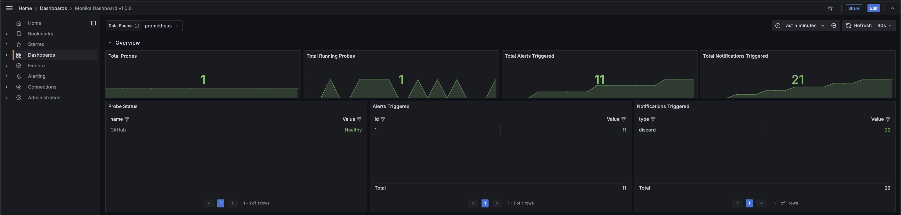

# Monika Dashboard

A simple Monika dashboard to display the exported Prometheus statistics of a Monika instance that runs using Prometheus exporter.

## Prerequisites

1. [Docker + Docker Compose](https://docs.docker.com/compose/install/)
2. [Monika](https://github.com/hyperjumptech/monika)

## Getting Started

1. Clone the repository
2. Run `docker-compose up -d` to start the Monika instance and the dashboard
3. Open the dashboard at `http://localhost:3000`. Default credentials are `admin`,`admin`
4. Connect the Prometheus data source to the dashboard
5. Install Monika
6. Run Monika with your configuration by using the `--prometheus 9100` flag
7. Wait for the metrics to be exported to Prometheus
8. Refresh the dashboard

## Screenshots

## Caveats

This is not ready yet as my [pull request is still pending](https://github.com/hyperjumptech/monika/pull/1338) so you need to build Monika from my branch. I'll update this README once it's merged.

## License

MIT
